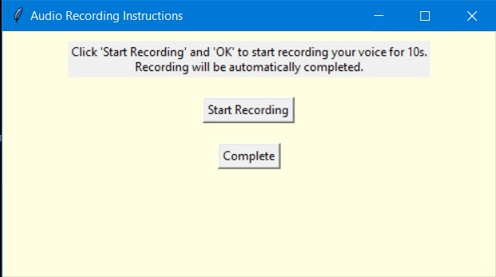
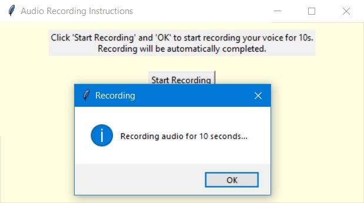
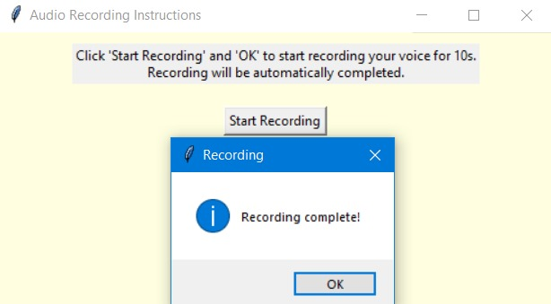
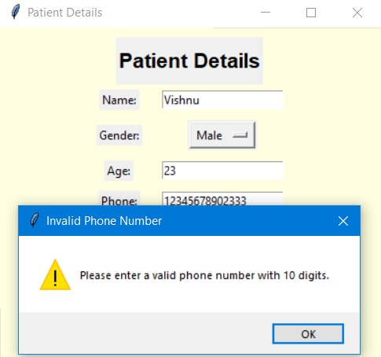
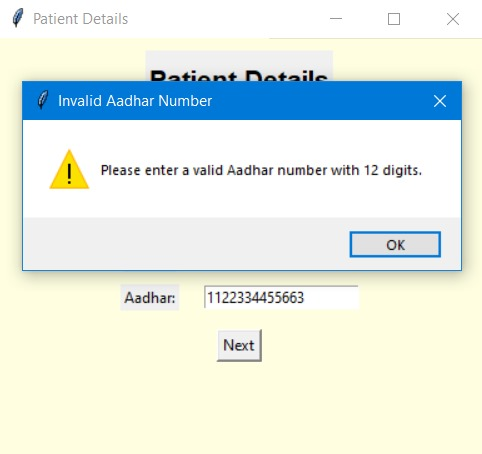
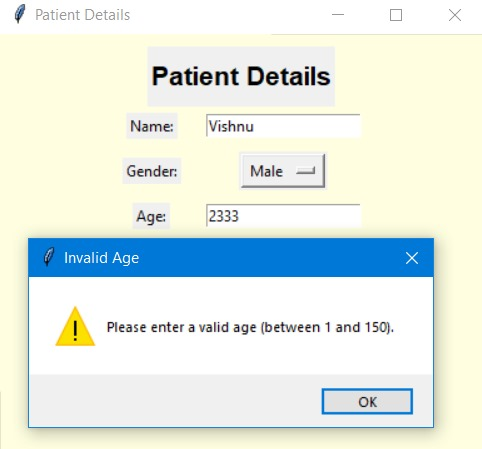
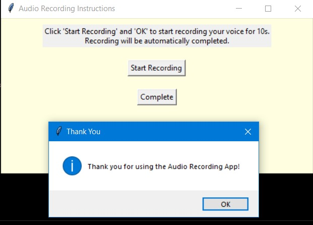

# Tkinter Audio Recording Application

Patient form and audio simulation application with Tkinter

## Screenshots

### Main Screen

### Recording in Progress

### Recording Complete

### Validation Example 1

### Validation Example 2

### Validation Example 3

### Thank You Screen

